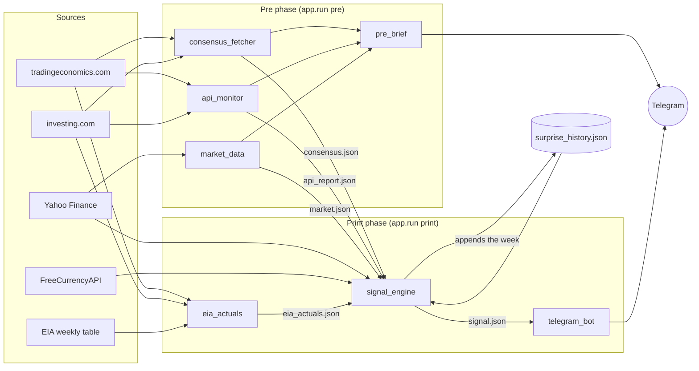
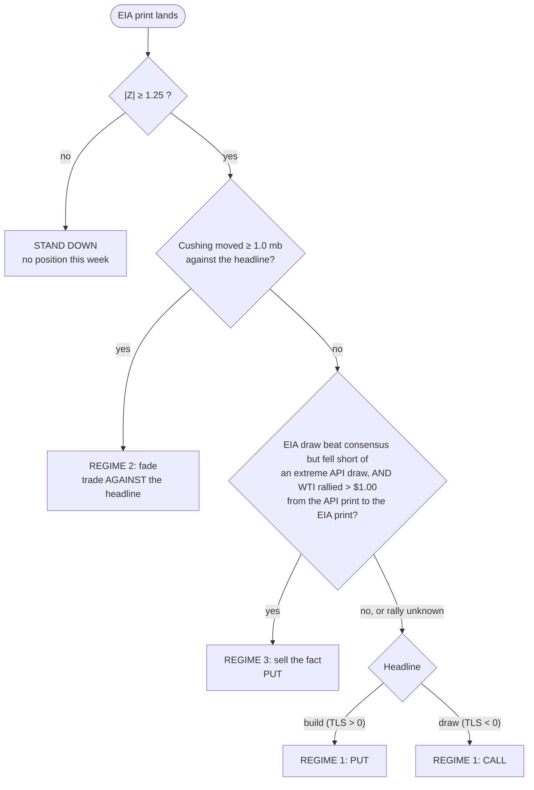
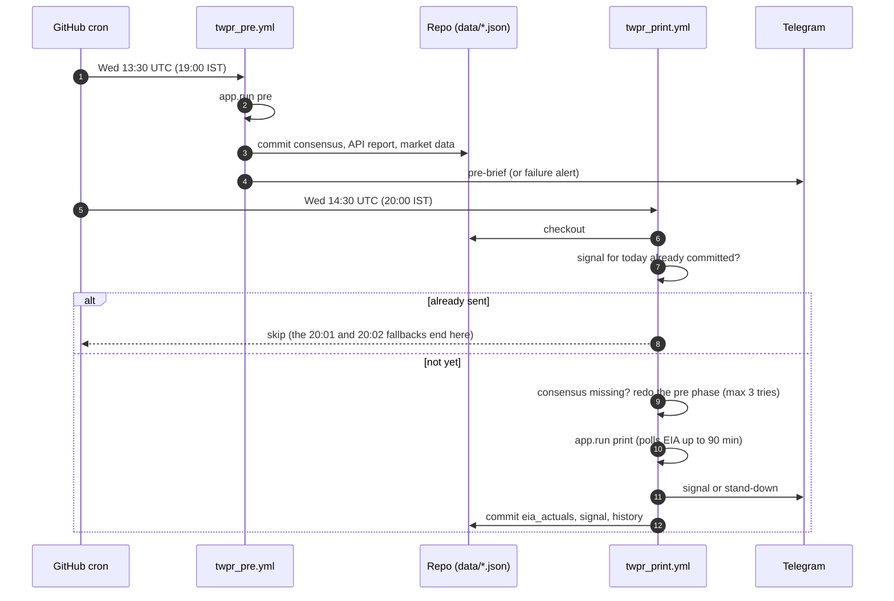

# TWPR: The Weekly Petroleum Report

A weekly **alert-and-record system** for buying MCX crude oil options around the EIA Weekly Petroleum Status Report (WPSR). It measures how far the EIA print beats or misses analyst consensus, decides whether the surprise is large enough to trade, and sends the decision to Telegram within seconds of the release.

> **Execution is manual.** The system decides, alerts and reminds. It never places, changes or cancels an order and has no broker connection. You trade by hand. Real money is involved: read [Known limits](#known-limits) before using it.

| | |
|---|---|
| **Instrument** | MCX `CRUDEOIL` (100 bbl) and `CRUDEOILM` (10 bbl mini), European options, **buyer only**, ITM, exited the same evening |
| **Event** | EIA WPSR, Wednesdays 10:30 New York (20:00 IST in summer, 21:00 IST in winter) |
| **Version** | v0.1: crude only, alert-and-record. Scope and completion criteria in [docs/V0_1_SCOPE.md](docs/V0_1_SCOPE.md) |
| **Stack** | Python 3.12, Playwright, BeautifulSoup, httpx, yfinance, Groq (optional prose), Telegram, GitHub Actions |

---

## 1. How it works

Every Wednesday the pipeline collects five inputs, computes one number (the **Z-score** of the total liquid surprise), and either recommends a trade or tells you to stand down.



Two scrapers race for every figure: both sites load at the same time and the **first valid value wins**, per indicator. A partial or guessed value is never written; a failed fetch exits non-zero, writes nothing and alerts Telegram.

### Wednesday timeline (US daylight saving)

```mermaid
gantt
    title Release-day schedule (IST, summer)
    dateFormat HH:mm
    axisFormat %H:%M
    section GitHub Actions
    Pre workflow (consensus, API, market, brief) :19:00, 5m
    Print workflow 20:00 with 20:01 / 20:02 fallbacks :20:00, 3m
    section Market
    EIA print (10:30 ET)                :milestone, 20:00, 0m
    Entry window opens (+2 min)         :milestone, 20:02, 0m
    Time stop (+35 min)                 :milestone, 20:35, 0m
    Hard exit (print + 2.5 h, capped)   :milestone, 22:30, 0m
    MCX session close                   :milestone, 23:30, 0m
```

In winter (US DST ends 1 Nov 2026) the print is 21:00 IST, MCX closes at 23:55 and the hard exit is 22:55 (capped one hour before the close).

---

## 2. The decision model

The model is the WPSR runbook ([docs/WPSR_WEDNESDAY_RUNBOOK.md](docs/WPSR_WEDNESDAY_RUNBOOK.md), adapted for MCX in [docs/WPSR_MCX_OPTIONS_RUNBOOK.md](docs/WPSR_MCX_OPTIONS_RUNBOOK.md)).

**Total liquid surprise (TLS)** combines the three headline stock changes, each as *actual minus consensus* in million barrels:

```
TLS = crude + w_g × gasoline + w_d × distillate
w_g = 0.80 (May–Sep) else 0.67        w_d = 0.70 (Nov–Feb) else 0.50
Z   = TLS / sigma
sigma = 1.4826 × MAD of the last 12 weekly TLS (needs ≥ 8 weeks, excludes the week being traded)
```

`SIGMA_METHOD=std` switches to plain standard deviation. MAD is the default because one freak week (12-08-2026, TLS +20 mb) would otherwise lock out real signals for 12 weeks.



| Rule | Detail |
|---|---|
| Gate | Trade only if \|Z\| ≥ 1.25 (inclusive) |
| Cushing check | Contradicts only if the opposite move is ≥ 1.0 mb (`CUSHING_MATERIAL_MB`); levels below 22 mb scale the expected move 1.5–2.0×, 22–30 mb linearly 1.5→1.0× |
| Regime 3 | Needs a measured overnight rally; unknown rally means it does not fire and Regime 1 applies |
| Option | ITM only. Delta 0.60–0.70, or 0.80–0.85 when OVX > 35 |
| Expiry | Nearest option expiry from MCX's 2026 calendar (two business days before the futures expiry); rolled to next month at 5 days or fewer. Never held to expiry |
| Expected move | The 0.15–0.30 USD per mb anchor **leads** the message. The volatility-scaled `beta_vol` model is shown as an unproven footnote |
| Band check | Move measured against MCX's 4% futures price limit (widens to 6%, 9%); flagged `near_band` at ≥ 75% |
| AI | Groq writes only an optional 3-sentence paragraph. It never touches the trade, and a stand-down asks it for nothing |

At today's volatility (OVX ~52) the gate needs |TLS| of roughly 6–7 mb, so **the system will mostly stand down**. The `pre_brief` message tells you the exact surprise required that week.

---

## 3. What you receive

**Pre-brief** (before the print): schedule, consensus, the API surprise and whether the market is pre-positioned, the option delta and expiry, the scorecard, the overnight rally, and how large the surprise must be for the model to trade.

**Signal alert** (at the print): regime and direction with the option, TLS / Z / sigma, the three surprises, Cushing, API alignment, the strike guide (a Black-76 estimate, see below), the rupee context, the expected move against the 4% band, the INR your lot count loses at three futures stops, the IST clock (entry, time stop, hard exit, close) and a checklist of what only the chart can settle.

**Reminders** (`app.watch`): entry window, 35-minute time stop, hard-exit warning and hard exit, sent to Telegram.

**Failure alerts**: every script alerts Telegram with the exception type and per-site reasons, then exits 1 with nothing written. A stale signal is refused, so last week's trade can never be resent as live.

---

## 4. Automation (GitHub Actions)

Two workflows in [.github/workflows/](.github/workflows/) run the release day unattended. Both use `xvfb-run` (the scrapers open a real, headed Chromium) and commit their data files back to the repo so the next job can read them.



| Workflow | Schedule (UTC) | Does |
|---|---|---|
| `twpr_pre.yml` | Wed 13:30 | `app.run pre` |
| `twpr_print.yml` | Wed 14:30, 14:31, 14:32 | Skip if today's signal exists; redo pre if consensus missing; `app.run print` |

- Jobs use `environment: production`; put secrets and variables in that GitHub environment (and do not add required reviewers, which would block the unattended run).
- **Secrets:** `TELEGRAM_BOT_TOKEN`, `TELEGRAM_CHAT_ID`, `FREECURRENCYAPI_KEY`, `GROQ_API_KEY`.
- **Variables:** `MCX_CRUDEOILM_LOTS` and/or `MCX_CRUDEOIL_LOTS`, `GROQ_MODEL`, optional `SIGMA_METHOD`.
- Scheduled workflows run only from the default branch (`main`).
- **Move the cron hours one later on 1 Nov 2026** (print becomes 15:30 UTC) and back on 14 Mar 2027, or the run misses the print.
- GitHub cron can start 5–20 minutes late. That only delays the alert: `eia_actuals` polls for up to 90 minutes.
- `data/*` is git-ignored, so the workflows use `git add -f` for the specific files they own.

---

## 5. Data contract

Every file is written by exactly one script and read by the engine. File names live in one place, `app/utils/common.py`; a test fails if any other module spells one.

| File | Producer | Contents |
|---|---|---|
| `consensus.json` | `consensus_fetcher` | crude / gasoline / distillate consensus, crude previous, source per indicator, release date |
| `api_report.json` | `api_monitor` | API crude change (Tuesday report). Crude only: the other API figures are paywalled |
| `market.json` | `market_data` | WTI, ATR(20), OVX, CL1–CL2, 3-2-1 crack, Brent–WTI, DXY, overnight rally, USD/INR 5-session trend |
| `eia_actuals.json` | `eia_actuals` | crude, Cushing, gasoline, distillate changes; Cushing level; refinery utilisation change |
| `surprise_history.json` | `surprise_history` | weekly surprises; sets sigma; the engine appends each live week |
| `signal.json` | `signal_engine` | the decision, option, expected move, sizing, schedule, checklist |
| `journal.json` | `journal` | your fills and post-print price paths (local only, never in CI) |

Consensus and actuals must share one release date; the API report must be the Tuesday before; files older than 2 days are refused unless `--allow-stale`.

---

## 6. MCX mechanics the system models

- **Contracts:** `CRUDEOIL` 100 bbl (tick Rs 0.10), `CRUDEOILM` 10 bbl (tick Rs 0.05); European options quoted in Rs per barrel; strike interval Rs 50; 75 ITM / 1 near / 75 OTM strikes each side. Black-76 pricing.
- **Expiry:** two business days before the futures expiry, from MCX's 2026 launch calendar (October 2026: futures Mon 19th, options Thu 15th). Months outside the loaded calendar (2027 on) fall back to the 19th and are flagged `assumed_19th`.
- **Holidays:** 16 trading holidays in 2026 loaded; only four close the evening session. A closed release-day evening triggers a loud warning.
- **Session close:** 23:30 IST during US daylight saving, 23:55 from 2 Nov 2026 to 12 Mar 2027.
- **Devolution:** at expiry a long option becomes a futures position. The system therefore rolls at 5 days or fewer and you exit the same evening.
- **Buyer's premium** is blocked upfront in full; a deep-ITM option costs roughly Rs 1.3 lakh per crude lot or Rs 13,000 per mini lot (estimate).
- **Strike guide:** no option chain is available, so `options.strike_guidance` estimates the target-delta strikes from Black-76 with OVX as implied volatility and futures ≈ WTI × USD/INR. It is an estimate to aim your search, never a quote.
- **USD/INR:** yfinance, then FreeCurrencyAPI. There is no default rate: with neither source the run stops and alerts.

Full facts and sources: [CLAUDE.md](CLAUDE.md), [docs/MARKET_FACTORS.md](docs/MARKET_FACTORS.md).

---

## 7. Setup

```bash
pip install -r requirements.txt
python -m playwright install chromium
cp .env.example .env        # then fill in the values below
```

| Setting | Purpose |
|---|---|
| `TELEGRAM_BOT_TOKEN`, `TELEGRAM_CHAT_ID` | Alerts and failure notices |
| `FREECURRENCYAPI_KEY` | USD/INR backup when yfinance fails |
| `MCX_CRUDEOIL_LOTS`, `MCX_CRUDEOILM_LOTS` | How many lots you trade per signal (start with 1 mini). Unset: no INR risk line |
| `MCX_CRUDEOIL_LOT_SIZE` (100), `MCX_CRUDEOILM_LOT_SIZE` (10) | MCX contract sizes in barrels; validated, not lot counts |
| `SIGMA_METHOD` | `mad` (default) or `std` |
| `GROQ_API_KEY`, `GROQ_MODEL` | Optional narrative paragraph (use a model your account can access, e.g. `qwen/qwen3.8-27b`) |

`MCX_NATURALGAS_LOT_SIZE` and `MCX_NATURALGASM_LOT_SIZE` are reserved and unused. `.env` is git-ignored; never commit secrets.

---

## 8. Running it by hand

Everything runs from the repo root with `python -m` (the scrapers use relative imports).

```bash
# Release day
python -m app.run pre                       # consensus, API, market data, pre-brief
python -m app.run print --watch             # actuals, signal, alert, then reminders
python -m app.run all --replay 23-09-2026   # a past release end to end (replay-stamped)
python -m app.run all --dry-run             # list the commands only

# Individual stages
python -m app.consensus_fetcher [--date DD-MM-YYYY] [--sites tradingeconomics]
python -m app.api_monitor [--once] [--date DD-MM-YYYY]
python -m app.eia_actuals [--once] [--date DD-MM-YYYY]
python -m app.market_data [--date DD-MM-YYYY]
python -m app.signal_engine [--allow-stale]
python -m app.telegram_bot [--allow-stale]
python -m app.pre_brief --print
python -m app.watch --dry-run

# History and the record
python -m app.surprise_history --backfill   # one-off: past weekly surprises
python -m app.journal fill ...              # log a fill; slippage and estimated net
python -m app.journal path                  # WTI at 0/1/2/5/10/15/30/60 min after the print
python -m app.journal show                  # wins, net, slippage, move by minute
```

`run` executes each stage as its own process and stops at the first failure with a Telegram alert naming what was skipped.

---

## 9. Repository layout

```
app/
  run.py, pre_brief.py, watch.py, journal.py    release-day tools and the record
  consensus_fetcher.py, api_monitor.py,
  eia_actuals.py, market_data.py,
  surprise_history.py                           input producers
  signal_engine.py, telegram_bot.py             decision and delivery
  model.py, options.py, currency.py             pure logic (TLS, Z, regimes, MCX rules, rupee context)
  scraper/                                      Playwright scrapers, shared row contract, URL registry
  utils/                                        racer, common (data-file names, env, logging), telegram, EIA levels
tests/                                          offline suite; network tests are opt-in
docs/                                           runbooks, market factors, v0.1 scope, review prompt
.github/workflows/                              twpr_pre.yml, twpr_print.yml
data/                                           runtime JSON (git-ignored; workflows force-add their files)
```

Scrapers: `TradingEconomicsScraper` and `InvestingCalendarScraper` share one base class and return identical rows (`release_date`, IST `time`, `actual`/`consensus`/`previous` in million barrels); only `consensus` may differ because the sites poll different analyst panels. "Consensus" is TE's *Consensus* and investing.com's *Forecast*, named `consensus` everywhere. All URLs live in `app/scraper/sources.py`.

---

## 10. Testing

```bash
python -m pytest tests -q                                   # offline suite (default)
python -m pytest tests -m network -k tradingeconomics       # live URL health check
```

The offline suite covers the model, options and calendar rules, the engine, message formatting, the runner, the wiring between producers and consumers, and the full consensus race against fake scrapers, with no browser or network. Live replays of past releases use `app.run all --replay`.

---

## Known limits

- **The edge is unproven.** About 9 weeks of history, no backtest. Expect mostly stand-downs.
- **`beta_vol` is unreliable** and shown as a footnote; the one real print measured so far favoured the anchor.
- **Fragile data path:** scrapers can be blocked (investing.com 403/429), consensus posts late, Yahoo has contract-roll distortions and no CL1–CL2 near expiry. A failure alerts you and produces no signal.
- **Not modelled:** premium, spread, implied volatility and IV crush, which decide real P&L. The lot risk assumes the option loses delta × the futures stop.
- **Capital and band risk:** deep-ITM premium is large upfront; a 4% futures band lock can freeze options.
- **Nothing watches your position** except time reminders. No premium-stop watching (needs a broker feed).
- **2027:** calendars and holidays are not loaded; 2027 expiries are a flagged guess.
- **CI is new:** the Actions chain has not yet run through a real print.
- **Replays are approximate:** Yahoo keeps 5-minute bars about 60 days; the overnight rally can be roll-distorted.

Version scope, completion criteria (one live Wednesday plus three forward Wednesdays at minimum size) and the v0.2 candidates are in [docs/V0_1_SCOPE.md](docs/V0_1_SCOPE.md).
